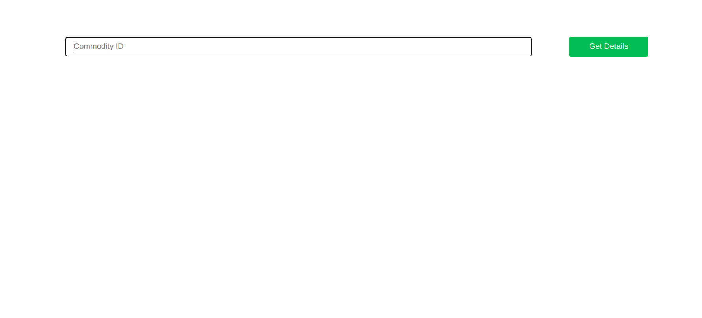

# Gramoday Backend Assignment
### Here is the live demo <a href="https://gramoday-assignment.netlify.app/" style="font-size: 40px">CLICK TO SEE DEMO</a>

## Setup

## Prerequisites

- Install and setup the frontend & backend server
 
[https://github.com/theydvgaurav/Assignment](https://github.com/theydvgaurav/Assignment)

### Clone Repository
- run `git clone https://github.com/theydvgaurav/Assignment`

### Installation
- run `cd Assignment`
- run `cd client && npm install`
- open another terminal and run `cd server && npm install`

### Project info

#### Frontend
Frontend contains an input field for `cmdtyID`. On clicking the button a get request will be sent using the api https://assignment-gydv.herokuapp.com/reports?cmdtyID=${query}. And then the corresponding results will be displayed.

### Backend
Backend is made using Node.js and Mongo Atlas. There are two apis:
- POST https://assignment-gydv.herokuapp.com/reports
- GET https://assignment-gydv.herokuapp.com/reports?cmdtyID=${query}

### API Testing
- use Postman and make GET request using the above url, provide the `cmdtyID` in place of '${query}'
- for POST request, make a reuqest on respected url and use the payload given below
- `{
"reportDetails": {
"userID": "user-1",
"marketID": "market-1",
"marketName": "Vashi Navi Mumbai",
"cmdtyID": "cmdty-1",
"marketType": "Mandi",
"cmdtyName": "Potato",
"priceUnit": "Pack",
"convFctr": 50,
"minPrice": 700,
"maxPrice": 900
}
}`

### Screenshots - Frontend

